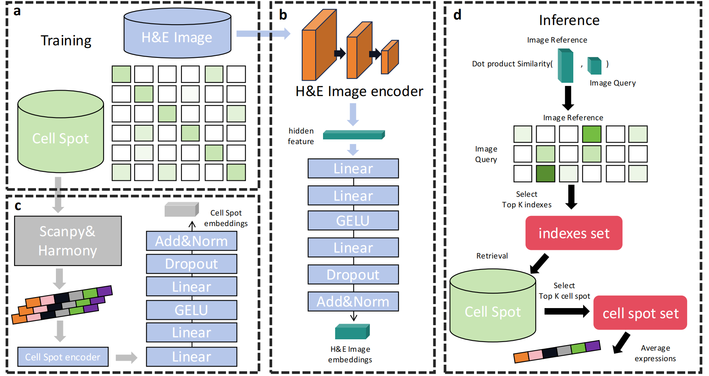

# HEClip


This code is prepared for **"HEClip: An Advanced CLIP-like  model for Gene Expression Prediction from Histology Images"**.

## Overview

### Abstract
HEClip is an innovative CLIP-based model designed to predict gene expression directly from histological images, addressing the challenges of accuracy and complexity faced by traditional methods. Histological images play a crucial role in medical diagnosis and research, but matching them with corresponding gene expression profiles is often time-consuming and costly. While various machine learning approaches have been proposed to tackle this issue, they often struggle with accuracy and involve complex workflows, limiting their effectiveness in predicting gene expression from image data. HEClip leverages contrastive learning and single-modality-centered loss functions to optimize the image encoder, enhancing the predictive power of the image modality while reducing reliance on the gene modality. Unlike traditional methods, HEClip employs image-based data augmentation strategies and achieves state-of-the-art performance across multiple benchmarks. Evaluations on the GSE240429 liver dataset demonstrate HEClip's strong performance in predicting highly expressed genes, achieving high correlation, hit rates, and stable cross-cell predictions.




## Installation
Download HEClip:
```git clone https://github.com/wq2581/HEClip```

Install Environment:
```pip install -r requirements.txt``` or ```conda env create -f environment.yaml```


## Running

### Train the HEClip.

   
   (1) download the GSE240429_data data.
   ```bash
   $ cd /path/to/GSE240429_data
   $ gdown --folder https://drive.google.com/drive/folders/1zssdBgGyzy3Jl9ISdWd1pEZKVhf1VRGz
   ```
   
   (2) download the image data.
   ```bash
   $ cd /path/to/image
   $ wget -O GSM7697868_GEX_C73_A1_Merged.tiff.gz "https://www.ncbi.nlm.nih.gov/geo/download/?acc=GSM7697868&format=file&file=GSM7697868%5FGEX%5FC73%5FA1%5FMerged%2Etiff%2Egz"
   $ wget -O GSM7697869_GEX_C73_B1_Merged.tiff.gz "https://www.ncbi.nlm.nih.gov/geo/download/?acc=GSM7697869&format=file&file=GSM7697869%5FGEX%5FC73%5FB1%5FMerged%2Etiff%2Egz"
   $ wget -O GSM7697871_GEX_C73_D1_Merged.tiff.gz "https://www.ncbi.nlm.nih.gov/geo/download/?acc=GSM7697871&format=file&file=GSM7697871%5FGEX%5FC73%5FD1%5FMerged%2Etiff%2Egz"
   $ wget -O GSM7697870_GEX_C73_C1_Merged.tiff.gz "https://www.ncbi.nlm.nih.gov/geo/download/?acc=GSM7697870&format=file&file=GSM7697870%5FGEX%5FC73%5FC1%5FMerged%2Etiff%2Egz"
   ```

   (3) Train the model.
   ```bash
   $ cd /path/to/main.py
   $ python main.py
   ```
   
### Inference   

   (4) Inference.
   ```bash
   $ cd /path/to/infer.py
   $ python infer.py
   ```


## Quick start

If you want to use our model, you can download the pre-trained HEClip model from [here](https://drive.google.com/file/d/14RwK9U2LmgwM6YXHK9INy5UD1MbEmy1F/view?usp=drive_link) and quickly try it by the 'infer.py.'
   
